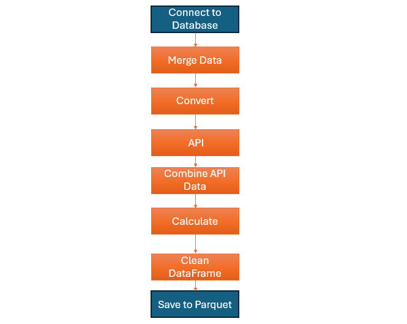
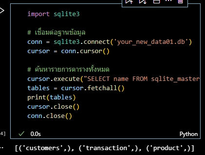
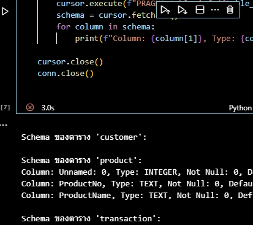
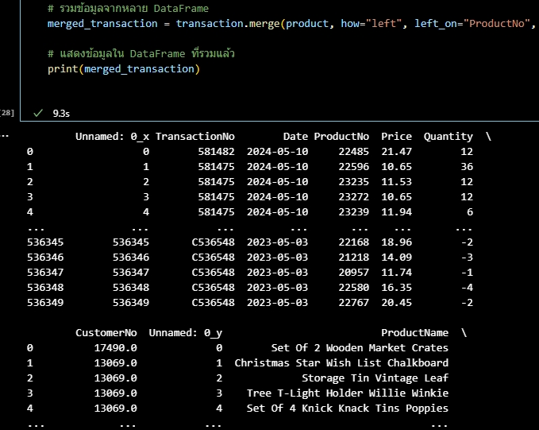
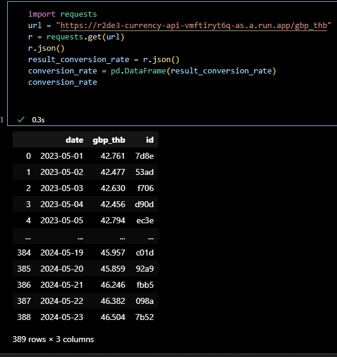
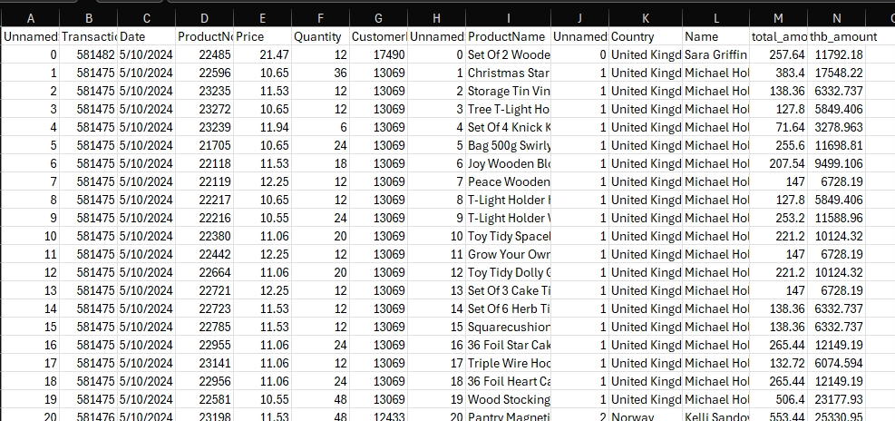

## Data Processing Pipeline: From Collection to Insights


## อธิบายเป้าหมาย

"โปรเจคนี้เน้นการรวบรวมข้อมูลจากหลายแหล่ง (API & Database) และนำมาผ่านขั้นตอนการทำความสะอาดข้อมูล (Data Cleansing) เพื่อให้พร้อมสำหรับการวิเคราะห์ข้อมูลเบื้องต้น (EDA) ด้วย Pandas"
--


## flowchart




## Tools

1. Python (ในตัวอย่างจะใช้ Version 3.13.1 / ระบบปฏิบัติการ windows 11)
2. Library ที่ต้องลงเพิ่ม
    1. requests
    2. Pandas
    3. sqllite3
    4. Visual Studio Code

## Process

1. Connect to DB
2. เรียกดู schema
3. Convert data to Pandas
4. Join tables
5. Requests API
6.Join the data all
7.save to parquet


## 1.Connect to DB

```  python

import sqlite3
database_path = 'ypur path/your_new_data01.db'
conn = sqlite3.connect('your_new_data01.db')
cursor = conn.cursor()
```

- มาดูผลลัพธ์ที่จะได้กันจะได้
- `[('customer',), ('product',), ('transaction',)]`




## 2. เรียกดู schema

```  python

# วนลูปผ่านแต่ละตารางและแสดง schema
for table_name in tables:
    print(f"\nSchema ของตาราง '{table_name}':")
    cursor.execute(f"PRAGMA table_info({table_name});")
    schema = cursor.fetchall()
    for column in schema:
        print(f"Column: {column[1]}, Type: {column[2]}, Not Null: {column[3]}, Default Value: {column[4]}, Primary Key: {column[5]}")

cursor.close()
conn.close()


```




## 3.Convert data to Pandas


```  
  python

import sqlite3
import pandas as pd

# เชื่อมต่อฐานข้อมูล
conn = sqlite3.connect('your_new_data01.db')

# ดึงข้อมูลทั้งหมดจากตาราง 'product' มาใส่ใน DataFrame
product = pd.read_sql_query("SELECT * FROM product", conn)
product = product.set_index('productNo') 
customers = pd.read_sql_query("SELECT * FROM customers", conn)
transaction = pd.read_sql_query('SELECT * FROM "transaction"', conn)
customers = customers.set_index('CustomerNo')  
transaction = transaction.set_index('TransactionNo')
# แสดงข้อมูลใน DataFrame
print(df)

# ปิดการเชื่อมต่อ
conn.close()

```

## 4.Join tables

- transaction: `ProductNo`, `CustomerNo`
- product: `ProductNo`
- customer: `CustomerNo`

```  
python


conn = sqlite3.connect('your_new_data01.db')

customer = pd.read_sql_query("SELECT * FROM customers", conn)
product = pd.read_sql_query("SELECT * FROM product", conn)
transaction = pd.read_sql_query('SELECT * FROM "transaction"', conn)

conn.close()
#Join tables T-T 
merged_transaction = transaction.merge(product, how="left", left_on="ProductNo", right_on="ProductNo").merge(customer, how="left", left_on="CustomerNo", right_on="CustomerNo")
print(merged_transaction)

```



## 5. Requests API


- เว็บเป้าหมาย URL หรือเว็บไหนก็ได้ที่เราต้องการ
- และแปลง result conversion rate  ให้เป็น Data Frame เพื่อให้สามารถ merge  ได้

```  
python

import requests
url = "https://r2de3-currency-api-vmftiryt6q-as.a.run.app/gbp_thb"
r = requests.get(url)
r.json()
result_conversion_rate = r.json()
conversion_rate = pd.DataFrame(result_conversion_rate)

```  




## 6.Join the data all

```  
python

conversion_rate['date'] = pd.to_datetime(conversion_rate['date'])
conversion_rate.head()
# แปลงคอลัมน์ 'Date' ใน transaction ให้เป็น datetime (ถ้ายังไม่ได้แปลง)
transaction['Date'] = pd.to_datetime(transaction['Date'])

final_df = merged_transaction.merge(conversion_rate, how="left", left_on="Date", right_on="date") # merge DataFrame กันเถอะ!
final_df

```  
- ตอนนี้เรามี column `Price` และ `Quantity` แต่ยังไม่มี total amount ซึ่งเกิดจากการคูณกันของ `Price * Quantity`
- **เพิ่ม column `thb_amount` ที่เกิดจากการคูณกันของ `total_amount` กับ `gbp_thb`**
- **ลบ Column ที่ไม่ใช้ และเปลี่ยนชื่อ Column**

```  
python

final_df["total_amount"] = final_df["Price"] * final_df["Quantity"]
final_df["thb_amount"] = final_df["total_amount"] * final_df["gbp_thb"]
final_df = final_df.drop(["date", "gbp_thb"], axis=1)
final_df.columns

```  

7.save to parquet

```  
 python

final_df.to_csv("final001.csv", index=False)
print("Data saved to output.csv")
#แนะนำให้เป็นparquetเพราะใช้พื้นที่ในการเก็บน้อยมาก
final_df.to_parquet("final001.parquet", index=False)
print("Data saved to output.parquet")

#หากจะ save เป็นไฟล์parquet ให้ลงlib pip install fastparquet ด้วย

``` 

